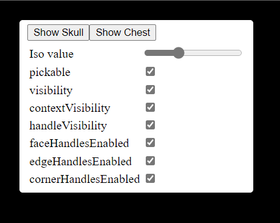
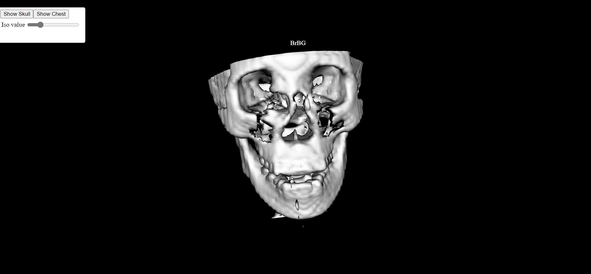
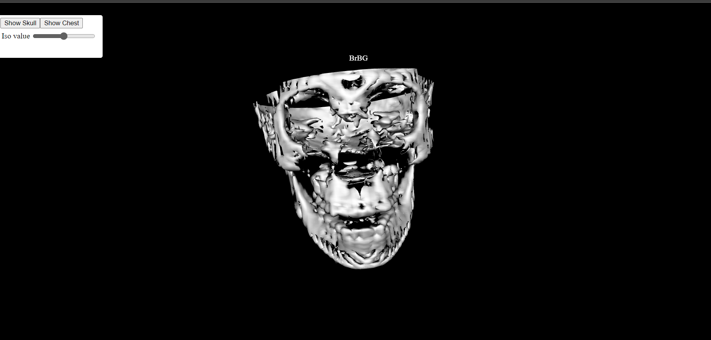
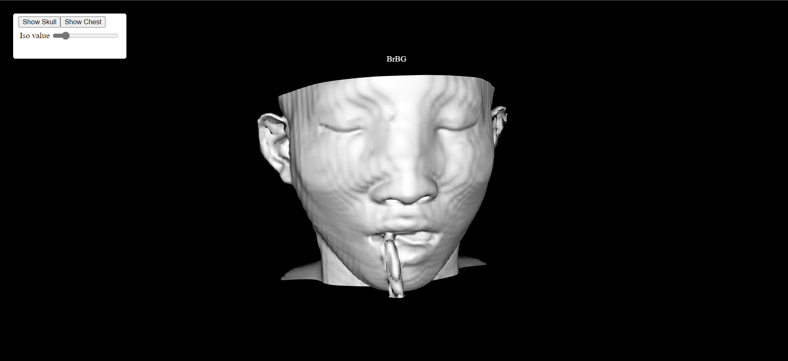
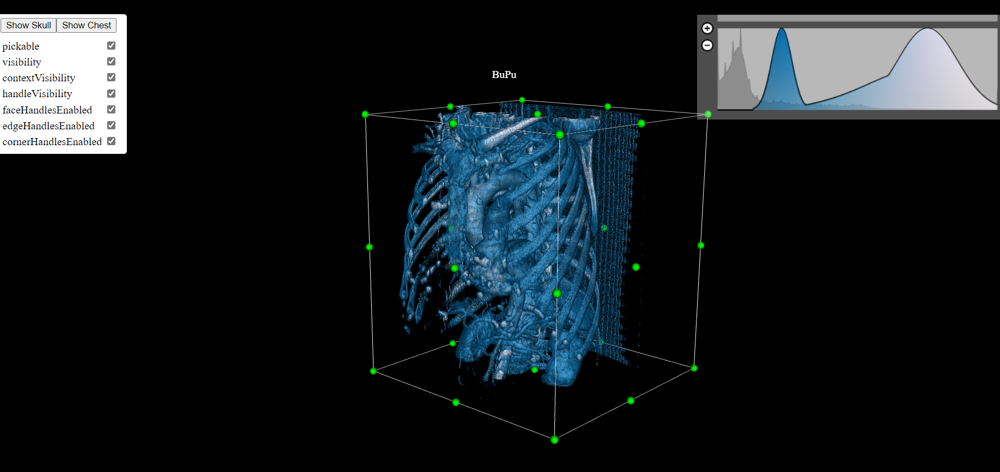
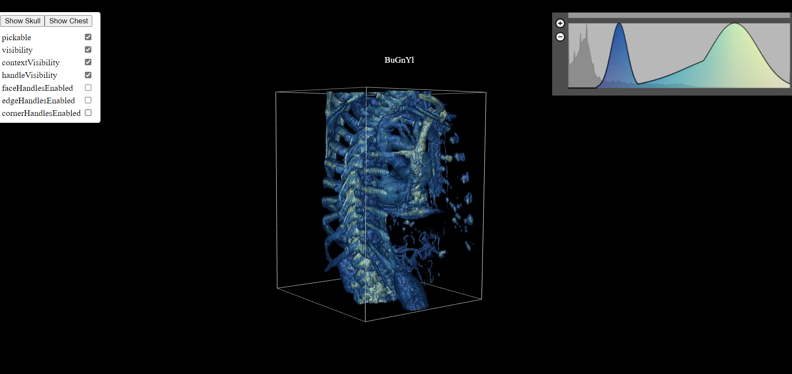
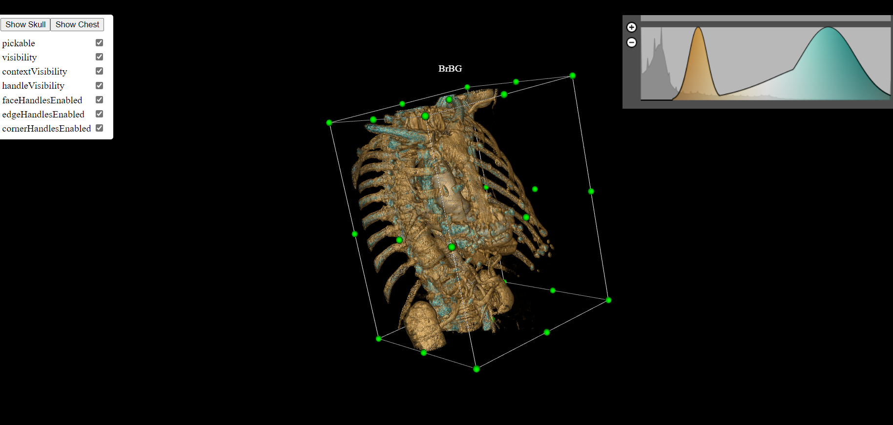

# **Course Project: Medical Visualization**
## Group Members:
### Amira Mahmoud - 1170498
### Hanan Tawfik - 4200369
### Kareem Sobhi - 4200339
### Tasneem Adel - 1162182

---
## **Problems**

**1.** Did not remove the resources from renderer. Therefore both models were being rendered overlapping.

**2.** We needed to seperate the controls for skull model and chest model to be viewed each with its own controls. 

**3.** Creating different functions for rendering models isolated the variables needed outside the current function.

---

## **Solutions**
**1.** Using the vtk.js renderer documentation we used the following code to clear the actors and volumes peviously rendered and call the function to re-draw the required model.

```py
  renderer.removeAllActors();
  renderer.removeAllVolumes();
```

**2.** Assigning different ids for the control panel elements and change their display style to "none" to remove them, and "initial" to give its default initial display style and show the needed elements.

```py
  document.getElementById("1").style.display = "initial";

  document.getElementById("1").style.display = "none";
```
**3.** Declared the required variable globally before the functions. As a trial to show and hide the actors.
```py
  const skullActor = vtkActor.newInstance();
  const chestActor = vtkVolume.newInstance();
  const widget = vtkImageCroppingWidget.newInstance();
  const widgetContainer = document.createElement('div');
```

## **Implementation**

### **Phase 1**

* Do the needed installations <br/>
  Install node-js and npm <br/>
  Initialize the project <br/>
  Install the dependencies <br/>
  Import VTk.js
* Created the structure for the project


### **Phase 2**

* Created the control panel GUI



* Created different functions for both models.
```py
  function skullModel(){};
  function chestModel(){};
```

### **Phase 3**

* Added the raycasting part Gaussian equation graph to the chest model function
* Solved bugs
* Code cleanup

## **Results**

**1.** Skull Model





**2.** Chest Model



* Cropping widget pickable


* Cropping widget not pickable and removed


* Minimizing cropping widget and removed handles



* Raycasting 

